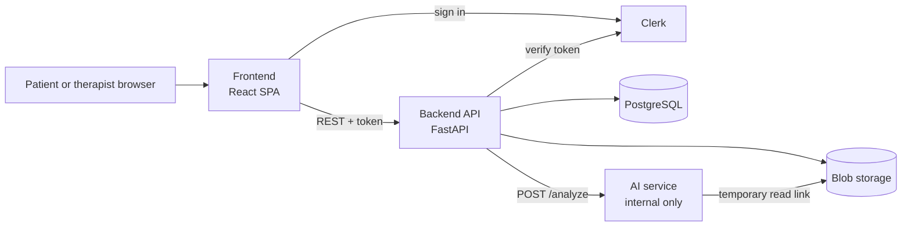

# PTAssist

AI-augmented remote physical therapy platform. A therapist assigns home exercises, the patient records a video of each one and uploads it, and the system counts reps, scores form, and gives feedback. The therapist reviews results and progress on a dashboard.

UCF Senior Design, Group A19. Sponsor: Dr. Md Mahfuzur Rahaman.

## Scope

**Proof of concept (Fall 2026):** web app for patients and therapists, video upload only, 5 exercises, synthetic and open-source data only.

**Stretch goals (Spring 2027):** live feedback during an exercise, a mobile patient app, and a job queue for analysis. The proof of concept is built so these stay possible.

## Architecture



| Part | What it does | Tech |
| --- | --- | --- |
| [Frontend](frontend/README.md) | One web app with a patient side and a therapist side | React, Vite, TypeScript, Mantine, Clerk, Orval |
| [Backend](backend/README.md) | The only entry point. Checks identity, role, and ownership on every request | FastAPI, SQLAlchemy, Alembic |
| [AI service](ai/README.md) | Turns a video into rep count, form score, and feedback. Not reachable from the internet | OpenCV, ffmpeg, MediaPipe Pose |
| Database | Users, plans, sessions, and AI results (JSONB) | PostgreSQL |
| Storage | Uploaded videos, private, deleted after 30 days | Azure Blob (MinIO locally) |
| Auth | Sign-in only. Roles live in our database | Clerk |
| [Hosting](infra/README.md) | API and AI service as containers, frontend as a static site | Azure Container Apps, Azure Static Web Apps |

## How an upload works

1. The patient uploads a video for an assigned exercise.
2. The backend stores it in private storage and marks the session `processing`.
3. A background task sends the AI service the session id and a temporary link to the video.
4. The AI service extracts body keypoints and scores the exercise.
5. The backend saves the result and marks the session `complete` (or `failed`).
6. The frontend polls the session status and shows the result to the patient and therapist.

## Repo layout

```
frontend/   React web app
backend/    FastAPI API, database models, migrations
ai/         Analysis service (keypoints and scoring)
infra/      Record of our Azure setup
docs/       Specs, plans, and reports
AGENTS.md   Context for AI coding agents
```

## Getting started

Setup steps are added in Sprint 1 as each service is built. You will need Docker, Python 3.12, and Node.js (LTS). The local stack (database, storage, API, AI service) will run with `docker compose up`.

## Working together

- Tasks live in [Jira](https://ptassist.atlassian.net/jira/software/projects/SCRUM/boards/1). Communication is on Discord.
- Branch from `main`, open a pull request, and get 1 approving review before merging.
- Never commit secrets, `.env` files, or videos.
- Use only synthetic or open-source data. Never real patient data.
- We describe the system as "HIPAA-ready," never "HIPAA compliant."

## Team

| Area | People |
| --- | --- |
| Project manager | Paulo |
| Backend and cloud | Paulo, Arthur |
| AI pipeline | Jonathan, Eduard, Carlos |
| Frontend | Zach, Sarah |
